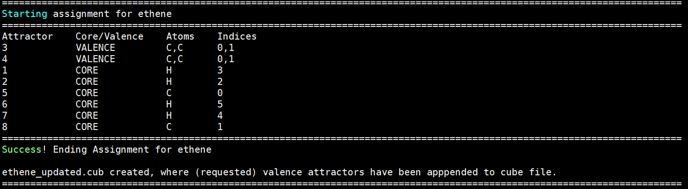

# AutoELF

This is a simple python program, that is designed to speed up the workflow of generating Electron Localisation Function (ELF) plots. This program assumes that the attractors file used as input has been generated using [Multiwfn](http://sobereva.com/multiwfn/), and is in the .pdb file format. 

## Installation

1. Download the main project directory.

2. Extract to a suitable location

3. Add parent directory location to PYTHONPATH environment variable, for example:
    ```
    export PYTHONPATH=$HOME/software/python_programming:$PYTHONPATH
    ```
    Where the python_programming directory contains the autoelf directory with all project files.

## Example Usage

1. We start in a directory containing the following files: ethene.xyz, ethene.pdb, ethene.cub
    - ethene.xyz : This is just the molecular geometry in the .xyz file format
    - ethene.pdb : This is the raw attractors file produced by Multiwfn, in the .pdb file format
    - ethene.cub : This is the cube file containing the data to visualise the ELF isosurface, produced by Multiwfn

2. We create a .py script named ethene.py containing the following two lines:
    ```
    from autoelf import *
    auto_elf_assign("ethene.xyz", "ethene.pdb", interest_atoms=[0,1], final_cube=True)
    ``` 
    We have specified the two required positional arguments, xyzfile and pdbfile. We have also specified that we are interested in any VALENCE attractors that are assigned to atoms 0 and 1 (the two carbon atoms). Finally, we have specified that we would like to add any VALENCE attractors of interest to the provided cube file, so that we may visualise everything (geometry, ELF isosurface and attractors) together easily.

3. We execute the command : python3 ethene.py

4. Output:
     

5. What files are produced ?
    - ethene_all.xyz --> Contains all CORE and VALENCE attractors appended as dummy atoms to molecular geometry.
    - ethene_requested.xyz --> Contains all VALENCE attractors corresponding to atoms of interest appended as dummy atoms to molecular geometry.
    - ethene_updated.cub --> Produced if final_cube was set to True. Contains ELF isosurface, molecular geometry and VALENCE attractors (all or of interest). This can be visualised in programs such as Chemcraft, Avogadro and VMD.
